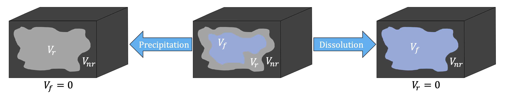

# What is DARTS?

**Delft:**
    we belong to Civil Engineering and Geoscience (CEG) Department at Civil Engineering Faculty of TU Delft. The development team directly linked to the new GeoEnergy program which connects Geology, Geophysics and Petroleum Engineering sections of the department.

**Advanced:**
    the simulation framework is based on the recently proposed Operator-Based Linearization (OBL) approach, which helps to decouple the complex nonlinear physics and advanced unstructured discretization from the core simulation engine. The framework is targeting the solution of forward and inverse problems.

**Research:**
    the development team includes five PhD students from the CEG department and multiple MSc students working on their thesis project on DARTS platform. The simulation platform is developed within Delft Advanced Reservoir Simulation (DARSim) program and linked to multiple research in the area of reservoir simulation, inverse modeling and uncertainty quantification.

**Terra:**
    the developed framework is utilized for forward and inverse problems in petroleum engineering, low- and high-enthalpy geothermal applications, subsurface storage and subsurface integrity. The primary focus and developed capabilities are currently cover low-enthalpy geothermal operations which include multicomponent multiphase flow of mass and heat with complex chemical interactions. Another focus is thermal-compositional processes for Enhanced Oil Recovery.

**Simulator:**
    the main simulation kernel implemented on multi-core CPU and many-core GPU architectures. Advance multiscale nonlinear formulation improves the performance of forward and inverse models. Additional afford invested in representative proxy models for complex subsurface processes including
    multiphase multicomponent flow.

## Introduction

DARTS is constructed within the Operator-based Linearization (OBL) framework for general-purpose reservoir simulations. The 'super-engine' in DARTS contains the governing equations characterizing the general thermal-compositional-reactive system should be expressed in form of operators, which are the functions of the thermodynamic state. These operators are then utilized to construct the residual and Jacobian for the solution of a nonlinear system using interpolation in thermodynamic parameter space. The values and derivatives of these operators at the supporting points will be evaluated adaptively during the simulation or pre-calculated in form of tables  through the physics implemented in either C++ or Python.

The assembly of resulting Jacobian matrix in C++ is generalized and improved by the OBL approach, which greatly facilitates code development. The constructed linear system is passed to the dedicated linear solver for a solution. More details about the DARTS architecture are described in {cite:p}`Khait_PhD`.

To enable the convenient usage of DARTS, the functionalities in C++ are exposed to users via a Python interface. At the same time, the Python interface provides the possibility to integrate different external modules (e.g., packages for physical property calculation) into DARTS.

### Table of Contents

* {ref}`Conservation_Equations`
  * {ref}`Governing-Equations`
* {ref}`Operator_Form_of_Governing_Equations`
  * {ref}`Conservation-of-mass-and-energy`
  * {ref}`Well-treatment`
* {ref}`Various-physical-models`
  * {ref}`Treatment-of-porosity`
* {ref}`References`

(Conservation_Equations)=
## Conservation Equations

Mass and heat transfer involves a thermal multiphase flow system, which requires a set of equations to depict the flow dynamics. In this section, the governing equations and detailed spatial and temporal discretization and linearization procedures are introduced.

(Governing-Equations)=
### Governing Equations

For the investigated domain with volume {math}`\Omega`, bounded by surface {math}`\Gamma`, the mass and energy conservation can be expressed in a uniformly integral way, as

```{math}
\frac{\partial}{\partial{t}} \int_{\Omega}{M^c}d{\Omega} + \int_{\Gamma}{\bf{F}^c\bf{\cdot}{\bf{n}}}d{\Gamma} = \int_{\Omega}{Q^c}d{\Omega}.
```

Here, {math}`M^c` denotes the accumulation term for the {math}`c^{\mathrm{th}}` component ({math}`c = 1, \ldots, n_c`, indexing for the mass components, [e.g., water, {math}`\mathrm{CO_2}`] and {math}`c = n_c + 1` for the energy quantity); {math}`\bf{F}_c` refers to the flux term of the {math}`c^{\mathrm{th}}` component; {math}`{\bf{n}}` refers to the unit normal pointing outward to the domain boundary;
{math}`Q_c` denotes the source/sink term of the {math}`c^{\mathrm{th}}` component.

The mass accumulation term collects each component distribution over {math}`n_p` fluid phases in a summation form,

```{math}
    \begin{aligned}
        M^c = \phi\sum\limits^{n_p}_{j=1}x_{cj}\rho_js_j + (1-\phi), \quad c = 1, \ldots, n_c,
    \end{aligned}
```

where {math}`\phi` is porosity, {math}`s_j` is phase saturation, {math}`\rho_j` is phase density {math}`[\mathrm{kmol/m^3}]` and {math}`x_{cj}` is molar fraction of {math}`c` component in {math}`j` phase.

The energy accumulation term contains the internal energy of fluid and rock,

\begin{equation}
    \begin{aligned}
        M^{n_c+1} = \phi\sum\limits^{n_p}_{j=1}\rho_js_jU_j + (1 - \phi)U_r,
    \end{aligned}
\end{equation}

where {math}`U_j` is phase internal energy {math}`[\mathrm{kJ}]` and {math}`U_r` is rock internal energy {math}`[\mathrm{kJ}]`.
The rock is assumed compressible and represented by the change of porosity through:

\begin{equation}
    \phi = \phi_0 \big(1 + c_r (p - p_\mathrm{ref}) \big),
\end{equation}

where {math}`\phi_0` is the initial porosity, {math}`c_r` is the rock compressibility [1/bar] and {math}`p_\mathrm{ref}` is the reference pressure [bars].

The mass flux of each component is represented by the summation over {math}`n_p` fluid phases,

\begin{equation}
    \begin{aligned}
        \bf{F^c} = \sum\limits_{j=1}^{n_p}x_{cj}\rho_j \bf{u_j} + s_{j}\rho_{j} \textbf{J}_{cj}, \quad c = 1, \ldots, n_c.
    \end{aligned}
\end{equation}

Here the velocity {math}`\bf{u_j}` follows the extension of Darcy's law to multiphase flow,

```{math}
    \small
    \bf{u_j} = -\mathbf{K}\frac{k_{rj}}{\mu_j}(\nabla{p_j}-\bf{\gamma_j}\nabla{z}),
```

where {math}`\mathbf{K}` is the permeability tensor {math}`[\mathrm{mD}]`, {math}`k_{rj}` is the relative permeability of phase {math}`j`, {math}`\mu_j` is the viscosity of phase {math}`j` {math}`[\mathrm{mPa\cdot s}]`, {math}`p_j` is the pressure of phase {math}`j` [bars], {math}`\bf{\gamma_j}=\rho_j\bf{g}` is the specific weight {math}`[\mathrm{N/m^3}]` and {math}`z` is the depth vector [m].

The {math}`\textbf{J}_{cj}` is the diffusion flux of component {math}`c` in phase {math}`j`, which is described by Fick's law as

```{math}
    \textbf{J}_{cj} = - \phi \textbf{D}_{cj} \nabla x_{cj},
```

where {math}`\textbf{D}_{cj}` is the diffusion coefficient [m{math}`^2`/day].

The energy flux includes the thermal convection and conduction terms,

\begin{equation}
    \begin{aligned}
        \bf{F}^{n_c+1} = \sum\limits^{n_p}_{j=1}h_j\rho_j \bf{u_j} + \kappa\nabla{T},
    \end{aligned}
\end{equation}

where {math}`h_j` is phase enthalpy {math}`[\mathrm{kJ/kg}]` and {math}`\kappa` is effective thermal conductivity {math}`[\mathrm{kJ/m/day/K}]`.

Finally, the source term in mass conservation equations can be present in the following form

\begin{equation}
    \begin{aligned}
        {Q}^{c} = \sum\limits_{k=1}^{n_k}v_{ck}r_k, \quad c = 1, \ldots, n_c,
    \end{aligned}
\end{equation}

where {math}`q_j` is the phase source/sink term from the well, {math}`v_{ck}` is the stoichiometric coefficient associated with chemical reaction {math}`k` for the component {math}`c` and {math}`r_{k}` is the rate for the reaction.
Similarly, the source term in the energy balance equation can be written as

\begin{equation}
    \begin{aligned}
        {Q}^{n_c+1} = \sum\limits_{k=1}^{n_k}v_{ek}r_{ek}.
    \end{aligned}
\end{equation}

Here {math}`v_{ek}` is the stoichiometric coefficient associated with kinetic reaction {math}`k` for the energy and {math}`r_{ek}` is the energy rate for kinetic reaction.

The nonlinear equations are discretized with the finite volume method using the multi-point flux approximation on general unstructured mesh in space and with the backward Euler approximation in time. For the {math}`i^{\mathrm{th}}` reservoir block, the governing equation in discretized residual form reads:
```{math}
    \begin{aligned}
        R^c_i = V_i \Big(M^{c}_i(\omega_i) - M^{c}_i(\omega^n_{i}) \Big) -
        \Delta{t} \Big(\sum_l{A_{l}F^{c}_{l}(\omega)} + V_iQ^{c}_{i}(\omega) \Big) = 0, \quad c = 1, \ldots, n_c+1.
    \end{aligned}
```
Here {math}`V_i` is the volume of the {math}`i^{th}` grid block, {math}`\omega_{i}` refers to state variables at the current time step, {math}`\omega^{n}_i` refers to state variables at previous time step, {math}`A_l` is the contact area between neighboring grids.

(Operator_Form_of_Governing_Equations)=
## Operator Form of Governing Equations

DARTS includes capabilities for the solution of forward and inverse problems for subsurface fluid and heat transport.  The OBL approach is employed in DARTS for the solution of highly nonlinear problems. It was proposed recently for generalized complex multi-phase flow and transport applications and aims to improve the simulation performance {cite:p}`Voskov2017_JCP,Khait2018_geothermics`. For spatial discretization, a finite volume fully implicit method in combination with two-point flux approximation on unstructured grids is implemented in DARTS. Besides conventional discretization in temporal and spatial space, DARTS also utilizes discretization in physical space using the OBL approach.

With the OBL approach, the governing equations are written in form of state-dependent operators. The state-dependent operators can be parameterized with respect to nonlinear unknowns in multi-dimension tables under different resolutions. The values and derivatives of the operators in the parameter space can be interpolated and evaluated based on supporting points. For the adaptive parameterization technique {cite:p}`Khait2018_SPE`, the supporting points are calculated `on the fly' and stored for later re-usage, which can largely save time for parameterization in high-dimension parameter space (i.e. in multi-component compositional simulations). At the same time, the Jacobian assembly becomes flexible with the OBL, even for very complex physical problems.


*Parameterization of the operators in 2D (pressure \& enthalpy) space with a predefined OBL resolution [adapted from]{cite:p}`Khait_JPSE`. Here, the size of the quadrilateral represents the resolution for an operator interpolation.*

(Conservation-of-mass-and-energy)=
### Conservation of mass and energy

Pressure, temperature and overall composition are taken as the unified state variables in a given control volume in general-purpose thermal-compositional simulation. Upstream weighting of the physical state is used to determine the flux-related fluid properties determined at the interface {math}`l`. The discretized mass conservation equation in operator form for girdblock (here we omit {math}`i`) reads:

\begin{equation}
V\phi_0[ \alpha_c (\omega) -\alpha_c( \omega_n)]-\Delta t\sum_{l\in L(i)}\sum_{j=1}^{n_p}[\Gamma^l\beta_{cj}^l(\omega^u)\Delta\psi_j^l + \Gamma_d^l\gamma_{j}^l(\omega)\Delta \chi_{cj}]+\Delta t V \delta_c(\omega)=0 .
\end{equation}

where {math}`V` is the control volume, {math}`\omega_n` is the physical state of block {math}`i` at the previous timestep, {math}`\omega` is the physical state of block {math}`i` at the new timestep, {math}`\omega^{u}` is the physical state of upstream block, {math}`\Gamma^l` and {math}`\Gamma_d^l` are the fluid and diffusive transmissibilities respectively and {math}`L(i)` is a set of interfaces for gridblock {math}`i`.

Here we defined the following state-dependent operators,
```{math}
:label: belta
\begin{align}
\alpha_{cf}\left(\omega\right) &= \Big(1+c_r(p-p_{ref})\Big)\sum_{j=1}^{n_p}x_{cj}\rho_js_j, \ c = 1,\ldots,n_c; \\
\beta_{cj}(\omega) &= x_{cj}\rho_jk_{rj}/\mu_{j}, \ c = 1,\ldots,n_c, \ j = 1,\ldots,n_p; \\
\gamma_{j}(\omega) &= \Big(1+c_r(p-p_{ref})\Big) s_j, \ j = 1,\ldots,n_p; \\
\chi_{cj}(\omega) &= D_{cj} \rho_j x_{cj}, \ c = 1,\ldots,n_c, \ j = 1,\ldots,n_p; \\
\delta_{c}(\omega) &= \sum\limits_{j=1}^{n_p}v_{cj}r_j(\omega),\ c = 1,\ldots,n_c.
\end{align}
```
The phase-potential-upwinding (PPU) strategy for OBL parametrization is applied in DARTS to model the gravity and capillary effect {cite:p}`Khait2018_SPE,lyuspeobl`. The potential difference of phase {math}`j` on the interface {math}`l` between block 1 and 2 can be written as:

\begin{equation}
\Delta \psi^l_{j} = p_1-p^c_{j}(\omega_1) - (p_2-p^c_{j}(\omega_2))-\frac{\rho_j(\omega_1)+\rho_j(\omega_2)}{2}g(z_2-z_1),
\end{equation}

where {math}`p^c_{j}` is the capillary pressure.

The discretized energy conservation equation in operator form can be written as:

```{math}
\begin{aligned}
V \phi_0 [\alpha_{ef}(\omega) &- \alpha_{ef}(\omega_n) ] - 
\Delta{t}\sum_{l\in L(i)} \sum_{j=1}^{n_p}[\Gamma^l\beta_{ej}^l(\omega^{u})\Delta\psi_{j}^l
+ \Gamma_d^l\gamma_{j}(\omega) \Delta \chi_{ej}]
+ \Delta t V \delta_e(\omega) \\
&+ (1-\phi_0)VU_r [\alpha_{er}(\omega) - \alpha_{er}(\omega_n)] - \Delta{t}\sum\limits_l{ (1-\phi_0)\Gamma_d^l\kappa_r\alpha_{er}(\omega) \Delta \chi_{er}} = 0,
\end{aligned}
```
where:
```{math}
:label: energy_acc_flux_6
\begin{align}
\alpha_{ef}(\omega)&= \Big(1+c_r(p-p_{ref}) \Big)\sum\limits^{n_p}_{j=1}{\rho_js_jU_j};\\
\beta_{ej}(\omega)&=h_j\rho_j{k_{rj}}/{\mu_j}, \ j = 1,\ldots, n_p;\\
\chi_{ej}(\omega) &= \kappa_j T_j, \ j = 1,\ldots,n_p;\\
\delta_{e}(\omega) &= \sum\limits_{j=1}^{n_j}v_{ej}r_{ej}(\omega)
\end{align}
```

In addition, for accounting the energy of rock, three additional operators should be defined:
```{math}
\begin{align}
\alpha_{eri}(\omega) &= \frac{U_r}{1+c_r(p-p_{ref})}, \\
\alpha_{erc}(\omega) &= \frac{1}{1+c_r(p-p_{ref})}, \\
\chi_{er}(\omega) &= T_r.
\end{align}
```
{math}`\alpha_{eri}` and {math}`\alpha_{erc}` represent the rock internal energy and rock conduction, respectively. {math}`U_r` is a state-dependent parameter, thus these two rock energy terms are treated separately.

This agglomeration of different physical terms into a single nonlinear operator simplifies the implementation of nonlinear formulations. Instead of performing complex evaluations of each property and its derivatives with respect to nonlinear unknowns, operators can be parameterized in physical space either at the pre-processing stage or adaptively with a limited number of supporting points. The evaluation of operators during the simulation is based on multi-linear interpolation, which improves the performance of the linearization stage. Besides, due to the piece-wise representation of operators, the nonlinearity of the system is reduced, which improves the nonlinear behavior {cite:p}`Khait2018_geothermics,Khait2018_SPE`.
However, to delineate the nonlinear behavior in the system, especially strong nonlinearity (e.g., at high-enthalpy conditions), it is necessary to select a reasonable OBL resolution to characterize the physical space. Too coarse OBL resolution may lead to a large error in the solutions {cite:p}`Voskov2017_JCP`.

(Well-treatment)=
### Well treatment

A connection-based multi-segment well is used to simulate the flow in the wellbore {cite:p}`Mark_2019_spe`. The communication between well blocks and reservoir blocks is treated in the same way as between reservoir blocks. Besides, the top well block is connected with a ghost control volume, which is selected as a placeholder for the well control equations. The bottom hole pressure (BHP), volumetric and mass rate controls are available in DARTS to model various well conditions.

As for the BHP well control, the injector and/or producer will operate under fixed bottom-hole pressure. A pressure constraint is defined at the ghost well block:

\begin{equation}
    p-p^{target} = 0.
\end{equation}

The volumetric rate control in DARTS is implemented through the volumetric rate operator {math}`\zeta^{vol}_p(\omega)`:

\begin{equation}
\Gamma^l\zeta_j^{vol}(\omega)\Delta{p} - Q^{target} = 0,
\end{equation}

where
```{math}
\zeta_j^{vol}= \frac{\hat{s}_j(\omega) \sum_c\beta_{cj}(\omega)}{\hat{\rho}_t(\omega)},
```
where {math}`Q^{target}` is the target volumetric flow rate at separator conditions {math}`[\mathrm{m^3/day}]`, {math}`\beta_{cj}(\omega)` is the mass flux operator as shown in {eq}`belta`, {math}`\hat{s}_j` and {math}`\hat{\rho}_t(\omega)` are the saturation and total fluid density respectively at separator conditions.

Any of the described well controls can be coupled with energy boundary conditions, defined by the temperature or enthalpy of the injected fluid at the injection well. Since temperature is the function of the thermodynamic state, it is expressed in operator form and the temperature well control reads:

\begin{equation}
    \chi(\omega) - T^{target} = 0,
\end{equation}

where {math}`\chi(\omega)` is defined by {eq}`energy_acc_flux_6` and {math}`T^{target}` is the target temperature of injected fluid. Alternatively, the enthalpy of the injected fluid can be defined:

\begin{equation}
    h(\omega) - h^{target} = 0,
\end{equation}

where {math}`h` is the enthalpy of the well control block, {math}`h^{target}` is the target enthalpy of injected fluid. For the production well control, enthalpy is taken equal to that of the upstream well block.

(Treatment-of-porosity)=
### Treatment of porosity

The porosity {math}`\phi` depends on the concentrations of the minerals  according to the relationship:
```{math}
    \phi=1-\sum^{M}_{m=1} \frac{{\cal M}_m c_{ms}}{\rho_m},
```
where {math}`M` is the number of reactive minerals, {math}`{\cal M}_m` is the molar mass of mineral {math}`m`, {math}`\rho_m` is the mass density of mineral {math}`m` and {math}`c_{ms}` represents and the molar concentration of mineral {math}`m`.

Let's represent the total bulk volume of control element in simulation

\begin{equation}
    V = V_f + V_r + V_{nr},
\end{equation}

and {math}`V_r` denotes reactive volume and {math}`V_{nr}` represents the non-reactive volume (not altered by any chemical reaction). Dividing this by the total (bulk) volume gives

\begin{equation}
    1 = \phi + \phi_r + \phi_{nr} = \phi^T + \phi_{nr},
\end{equation}

where {math}`\phi_r` represents the reactive volume fraction, {math}`\phi_{nr}` is the non-reactive volume fraction, and {math}`\phi^T` is the total porosity defined as the sum of the fluid porosity and reactive volume fraction. Since only the reactive volume and fluid porosity can change due to chemical reactions, it follows directly that the total porosity remains constant throughout simulation (when neglecting compressibility). This and the changes in volume fractions due to precipitation and dissolution is illustrated in the following figure.


*Schematic of the different volumes in the domain. The domain consists of three distinct regions, particularly the fluid volume which is occupies by all the mobile phases (liquid and gaseous in the case of two phase flow), the reactive volume which consist of solid phases that can react or precipitate, and finally the nonreactive volume (the part of the control volume which doesn't participate in any chemical reaction)*

Note that the fluid porosity can always be obtained with the following constitutive equation

```{math}
\phi = \phi^T \Big( 1 - {\sum_{m=1}^{M} \hat{s}_m} \Big),
```

where {math}`M` is the number of solid phases (occupying the reactive volume fraction) and {math}`\hat{s}_m` is the saturation of  solid phase. Please note that the {math}`s_{\alpha}` is the fluid saturation (defined over the pore volume) while {math}`\hat{s}_{m}` is the
{solid saturation of mineral phase {math}`m`} (defined over the pore and reactive rock volume).

(References)=
## References

```{bibliography} ../references.bib
```
