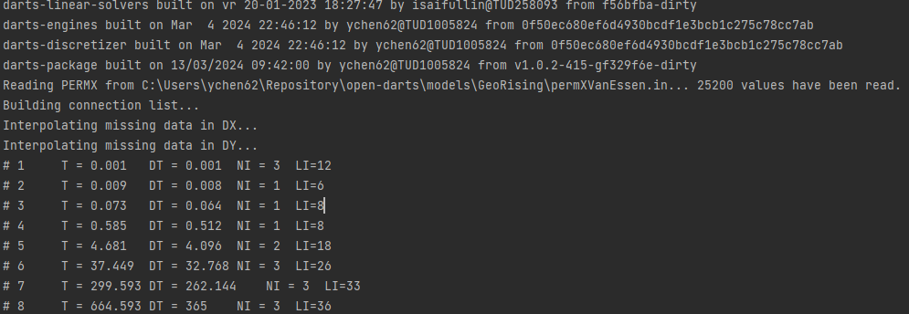
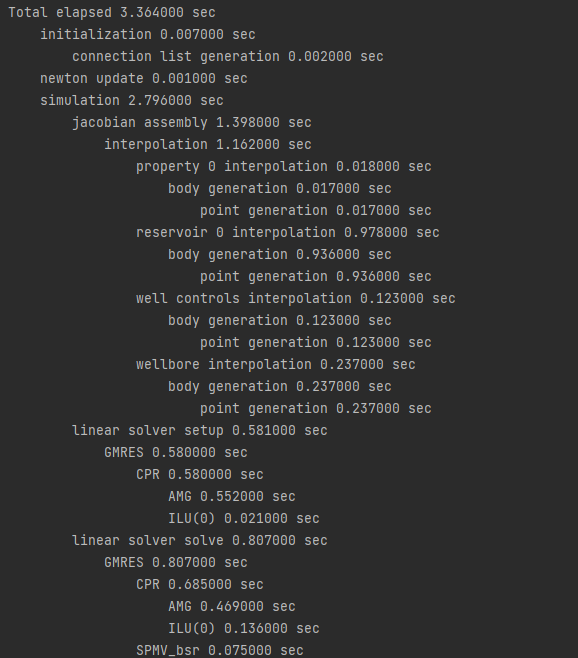
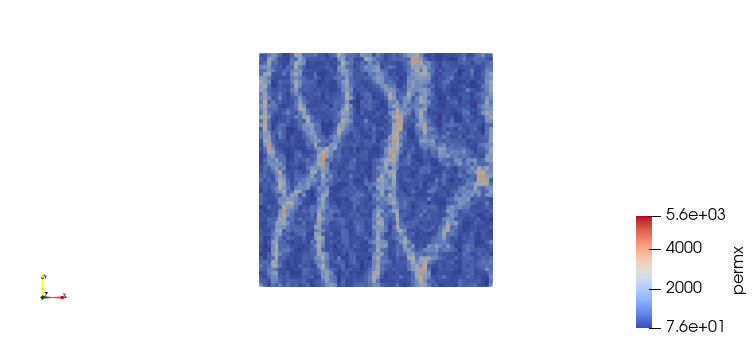
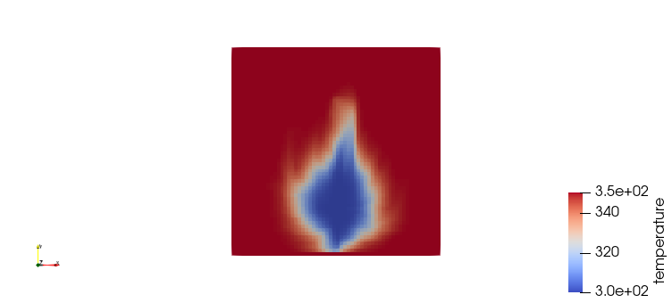

# Tutorial

### Getting started with any model

In order to use DARTS you need to set up the model. It usually includes a few Python scripts called `main.py`, `model.py`.
- `main.py` usually manages the initialization of a model, the simulation run, the time stepping, and the output types, e.g. `vtk` files, time data `Excel` files or plots.
- `model.py` defines the simulation domain or also called reservoir, computational grid and the static properties assigned to them. Then it also contains the description of the physics, and all the parameters required to define it.
- `slides.pptx` contains the explanation on basic thermal dynamics and steps to run the geothermal model.

They are usually organized in a way that `main.py` is a startup scripts where the model is created, then it calls for the model constructor or some other model methods overloaded in `model.py` which then initializes a model with a reservoir, a physics associated with the reservoir, an initial condition, and a boundary condition.

Apart of these three Python scripts, the project folder `GeoRising` may contain extra files used to initilize a reservoir, e.g. the permeability distrition file `permXVanEssen.in`. It also may include a `mesh` folder, or just *.geo, *.msh, *.grdecl files placed in the project folder. They define computational grids used in the model. After the simulation run the program may will create several output files in the project folder.
- `vtk` folder contains dynamic temperature, pressure solution of all grid cells, e.g. `solution_ts*.vts` and mesh of grid cells, e.g. `mesh.vts`
- `darts_time_data.pkl` is time data pickle file which contains the dynamic simulation results of Bottom Hole Pressure (BHP), temperature, injection/production water rate,
accumulated water produced of the injection wells and production wells for the given simulation time 
- `output.png` production well temperature profile in 3650 days with techinical temperature limit
- `solution.pvd` is xml file which contains the `vtk` information linking to `*.vtu` files in `vtk` folder
- `time_data.xlsx` is Excel file contains which contains the dynamic simulation results of Bottom Hole Pressure (BHP), temperature, injection/production water rate,
accumulated water produced of the injection wells and production wells for the given simulation time

Plenty of different models are located in [open-darts-models](https://gitlab.com/open-darts/open-darts/-/tree/development/models). As an example, we can run [GeoRising](https://gitlab.com/open-darts/open-darts/-/tree/development/models/GeoRising) model.

If you are using PyCharm as your IDE, you can use following steps to run `GeoRising` model
1. In Pycharm, click `Run` option at the top of the interface, then click `Edit configurations`.
2. In the pop-up window, select `Add New Configuration` and then select `Python`. Give a name to your program at the top of the window, e.g. `main`.
3. At field `Script path`, navigate to the `main.py` path, i.e. **../models/GeoRising/main.py**. Next, at field `Python interpreter`, select the interpreter which contains the open-darts package. In the end, click `OK` at the bottom of the window.
4. Run [main.py](https://gitlab.com/open-darts/open-darts/-/blob/development/models/GeoRising/main.py) by clicking `Run` at the top of thw PyCharm window.
5. While running the program, in the Command window at the bottom, you can see the simulation program output that usually consist of package versions of darts-linear-solvers, darts-engines, and darts-discretizer; simulation time; time step; number of newton iterations (NI); the number of linear iterations (LI). If you see the repeating output from time steps afterward, it means that the program is working fine.

6. At the end of the program you can see two paragraphs which give the simulation time and the number of iterations of the current program.

7. The standard output of the program may be found in a new folder called `vtk` which contains VTK snapshots of every times step and the `mesh.vts` file which contains the static reservoir properties, such as permeability and porosity,

top view of permeability (`mesh.vts`)

top view of temperature distribution after 10 years' simulation (`solution_ts1.vts`)

a picture `output.png` gives the production temperature,

`output.png`

`time_data.xlsx` specifies the dynamic simulation results of injection wells and production wells.

If you are using console, you can use following step to run `GeoRising` model

1. In your console, navigate to the folder `GeoRising` by calling `cd [path to GeoRising folder]`
2. Activate your conda environment which contains `open-darts` by calling `conda activate [name of your envrionment]`
3. Call `python main.py`
