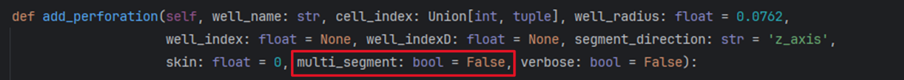
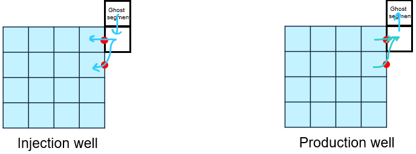
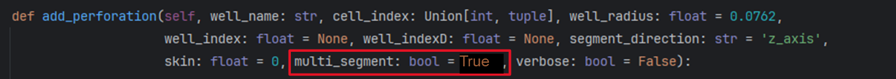
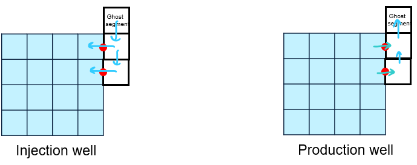

# `multi_segment` Input Argument in `add_perforation` Method for EPM Wells

## If `multi_segment = False`

When using multiple perforations with `multi_segment = False`, be cautious that the wellbore will consist of only **one segment**, and fluid flows between the wellbore segment and multiple reservoir cells through perforations.

{width=913 height=81}

If depths of reservoir cells are set correctly, there will be flow at perforations due to gravity, which does **not happen in reality**.

An example is given below with two perforations:

Therefore, to avoid flow due to gravity at perforations, it is better to always use `multi_segment = True`. In addition, the depths of the reservoir cells need to be specified correctly.

## If `multi_segment = True`

When using multiple perforations with `multi_segment = True`, the wellbore consists of **multiple segments** (one segment in front of each perforated reservoir cell), and this is a more accurate representation of fluid flow in the wellbore.  
Be careful to use the correct depths for reservoir cells; otherwise, fluid flow between the reservoir and wellbore will be inaccurate.

{width=892 height=79}

An example is given below with two perforations:

