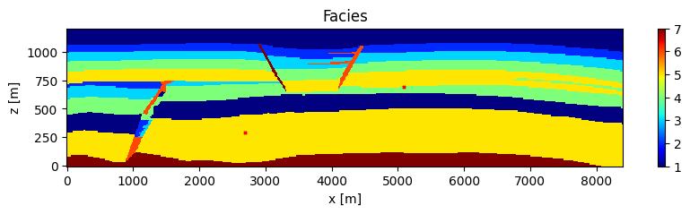
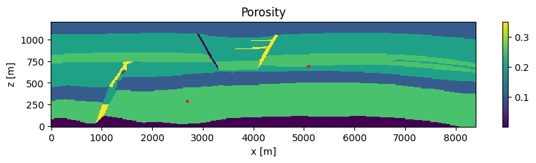

# SPE11b Carbon Capture and Storage Benchmark
The SPE11 comparative solution project (CSP) aims to provide a reference case for the development of numerical simulation of GCS and offers a baseline for simulation of CO2 storage in aquifers. 
The reservoir is a heterogeneous reservoir storage complex reminicent of the Norwegian continental shelf. 
Three versions of the benchmark are presented in the CSP. The second, 11b, is a 2D model at reservoir scale and conditions. 
The SPE11 CSP explicitly specifies all reservoir and fluid properties in Nordbotten et al. (2024). 
This repository contains a model implementation for the SPE11b utilizing the Delft Advanced Research Terra Simulator (DARTS) of Delft University of Technology. 

## Running the Simulation

Simulation parameters are configured using the `model_specs` list, where each entry is a dictionary describing a specific realization. 
The reporting grid of the SPE11b corresponds to a grid block of 10m by 10m and thus contains approx. 100K grid blocks.  

```python
nx = 840
nz = 120
model_specs = [
    {
        'check_rates': True,
        'temperature': 273.15 + 40,
        '1000years': False,
        'RHS': True,
        'components': ['CO2', 'H2O'],
        'inj_stream': [1 - 1e-10, 283.15],
        'nx': nx,
        'nz': nz,
        'dispersion': False,
        'output_dir': None,
        'post_process': None,
        'gpu_device': False
    }
]
```

| Option         | Description                                                                                                                                                     |
| -------------- |-----------------------------------------------------------------------------------------------------------------------------------------------------------------|
| `check_rates`  | If `True`, checks mass in place before and after each timestep to verify injected mass.                                                                         |
| `temperature`  | Temperature in Kelvin; if `None`, the model runs isothermally.                                                                                                  |
| `1000years`    | If `True`, introduces a 1000-year initialization period before the main simulation.                                                                             |
| `RHS`          | If `True`, uses a right-hand side correction to introduce mass to the well block. If `False`, uses `dartsmodel.physics.set_well_controls()` with mass rates.    |
| `components`   | List of components in the simulation (e.g., `['CO2', 'H2O']`).                                                                                                  |
| `inj_stream`   | Injection stream: list with component compositions (up to `nc-1` components) in the same order as `components` and the final entry as temperature (in Kelvin).  |
| `nx`           | Horizontal resolution of the model grid.                                                                                                                        |
| `nz`           | Vertical resolution of the model grid.                                                                                                                          |
| `dispersion`   | If `True`, enables dispersion with dispersivity set to 10; otherwise, dispersion is excluded.                                                                   |
| `output_dir`   | Output directory for simulation results. If `None`, a directory is auto-generated based on model specs.                                                         |
| `post_process` | If a string is provided, post-processes previously saved data in that folder instead of running the simulation.                                                 |
| `gpu_device`   | Runs the model on GPU if `True`; otherwise, on CPU.                                                                                                             |

## Reservoir and wells 
Seven different facies are defined for SPE11b. Facies 1 represents the storage
complex and serves as a capillary barrier to migrating CO2. Facies 2 through 5 consist of permeable reservoir
sands, while Facies 6 corresponds to fault infill. Finally, Facies 7 forms an impermeable barrier. In our model, the
geometry of the FluidFlower model is converted to the reservoir scale following the SPE11’s description. For all
simulations, a structured mesh is constructed and populated according to the facies descriptions.





In model 11b, z=0 is defined at the bottom of the reservoir and x=0 at the left edge. There are two wells. Well 1 is located at (x=2700, z=300), and well 2 at (x=5100,z=1100). 
Injection starts in well 1 at t = 0yr and continues until t = 50yr. Well 2 starts injection at t = 25yr, lasting until t = 50yr. In the post-injection period, 
the simulation continues for 1000 years. In both wells, CO2 is injected at 10degC. In 11b the injection rate is equal to 3024kg/day.
The wells are defined at their `well centers`, per their coordinates in meters, and passed to the reservoir object.
```python 
    well_centers = {
            "I1": [2700.0, 0.0, 300.0],
            "I2": [5100.0, 0.0, 700.0]
            }
    
    # structured reservoir
    m.reservoir = FluidFlowerStruct(timer=m.timer, layer_properties=layer_props, layers_to_regions=layers_to_regions,
                                    model_specs=specs, well_centers=well_centers)
```
The rate is specified in `m.inj_rate` as a list a where the first and second entry correspond to the mass injection rate of well 1 and 2 respectively. 
```python
    m.inj_rate = [inj_rate, inj_rate]
```
Two options, are included for the model, RHS-correction and well controls. If `self.specs['RHS'] = True`, `self.set_rhs_flux()` is defined. Otherwise `self.set_well_controls` is defined where each well object gets its own control:
```python
    for i, w in enumerate(self.reservoir.wells):
        self.physics.set_well_controls(well = w,
                                       control_type = well_control_iface.MASS_RATE,
                                       is_inj = True,
                                       target = self.inj_rate[i],
                                       phase_name = 'V',
                                       inj_composition = self.inj_stream[:-1],
                                       inj_temp = self.inj_stream[-1]
                                       )
        print(f'Set well {w.name} to {self.inj_rate[i]} kg/day with {self.inj_stream[:-1]} {self.components[:-1]} at 10°C...')
```
, acoording to `self.inj_stream`.   

## Initial and boundary conditions
In the SPE11b the temperatures at the top and bottom boundaries are fixed, all boundaries are impermeable and the boundary 
volumes are increased to 5e4Δz. A geothermal gradient of 25 degC/km is applied along with a temperature of 70 degC at the bottom boundary while pressure is hydrostatic. 
Initial conditions are set in `m.set_initial_conditions()` where, 
```python
    m.physics.set_initial_conditions_from_depth_table(mesh=self.reservoir.mesh, 
                                                      input_depth=input_depths,
                                                      input_distribution=self.input_distribution)
```
, specifies the initial conditions according to the input_depths and and input_idstributions. 

The temperature boundary conditions are included in the model by calling `m.set_top_bot_temp()` in the Newton loop for specified timestep:
```python
    def set_top_bot_temp(self):
        nv = self.physics.n_vars
        for bot_cell in self.reservoir.bot_cells:
            # T = 70 - 0.025 * z  - origin at bottom
            T_spec_bot = 273.15 + 70 - self.reservoir.centroids[bot_cell, 2] * 0.025
            target_cell = bot_cell*nv+nv-1
            self.physics.engine.X[target_cell] = T_spec_bot
    
        for top_cell in self.reservoir.top_cells:
            # T = 70 - 0.025 * z  - origin at bottom
            T_spec_top = 273.15 + 70 - self.reservoir.centroids[top_cell, 2] * 0.025
            target_cell = top_cell*nv+nv-1
            self.physics.engine.X[target_cell] = T_spec_top
        return
```

## Visualization 
The initial conditions are visualized by either calling, 
```python
    m.output.output_to_vtk(output_properties=output_props, ith_step=0)
```
, and exporting the initial conditions to as *.vtk files or by accessing the solution vector in `m.physics.engine.X` directly in python. 
```python
solution_vector = np.array(m.physics.engine.X)
for i, name in enumerate(vars):
    plt.figure(figsize = (10, 2))
    plt.title(name)
    c = plt.pcolor(grid[0], grid[1], solution_vector[i::n_vars][:nb].reshape(nz, nx), cmap = 'jet')
    plt.colorbar(c, aspect = 10)
    plt.xlabel('x [m]'); plt.ylabel('z [m]')
    plt.savefig(os.path.join(m.output_folder, f'initial_conditions_{name}.png'), bbox_inches='tight')
    plt.close()
```

## Model physics
### Thermodynamics 
Thermodynamics properties are provided by the DARTS-flash python module. 
A negative flash procedure with successive substitution is employed for resolving thermodynamic equilibrium
calculations (Michelsen, 1982; Whitson and Michelsen, 1989). The fugacities of the vapor phase are evaluated
using a cubic equation of state (Peng and Robinson, 1976) and the fugacities of the water phase are calculated
using an activity model based on Henry’s constants (Ziabakhsh-Ganji and Kooi, 2012). The property correlations for SPE11
and open-DARTS are presented in the following table. 


In the model, these property correlations are specified in the `property_containers` that are defined per region in the `compositional` physics class of the `DarstsModel`. In `DartsModel.set_physics()`:
```python
for i, (region, corey_params) in enumerate(corey.items()):
    diff_w = 1e-9 * 86400 # m2/day
    diff_g = 2e-8 * 86400 # m2/day
    property_container = PropertyContainer(components_name=self.components, phases_name=phases, Mw=comp_data.Mw,
                                           min_z=zero / 10, temperature=temperature)

    property_container.flash_ev = NegativeFlash(flash_params, ["PR", "AQ"], [InitialGuess.Henry_VA])
    property_container.density_ev = dict([('V', EoSDensity(eos=pr, Mw=comp_data.Mw)),
                                          ('Aq', Garcia2001(self.components)), ])
    property_container.viscosity_ev = dict([('V', Fenghour1998()),
                                            ('Aq', Islam2012(self.components)), ])
    property_container.diffusion_ev = dict([('V', ConstFunc(np.ones(nc) * diff_g)),
                                            ('Aq', ConstFunc(np.ones(nc) * diff_w))])
    property_container.enthalpy_ev = dict([('V', EoSEnthalpy(eos=pr)),
                                           ('Aq', EoSEnthalpy(eos=aq)), ])
    property_container.conductivity_ev = dict([('V', ConstFunc(8.4)),
                                               ('Aq', ConstFunc(170.)),])
    property_container.rel_perm_ev = dict([('V', ModBrooksCorey(corey_params, 'V')),
                                           ('Aq', ModBrooksCorey(corey_params, 'Aq'))])
    property_container.capillary_pressure_ev = ModCapillaryPressure(corey_params)
    self.physics.add_property_region(property_container, i)
```

### Dispersion 
The diffusive flux is described by Fick's law and includes a dispersivity term. This term multiplies the scalar dispersivity coefficient, E, 
with Darcy’s velocity. The velocity vector is reconstructed at cell centers using a least-squares
solution of fluxes across all cell’s interfaces, then averaged between neighboring cells and explicitly incorporated
into the numerical approximation of the dispersion term. By calling, 
```python
    m.init_dispersion()
```
, velocity reconstruction is activated and the dispersion coefficients are set. 