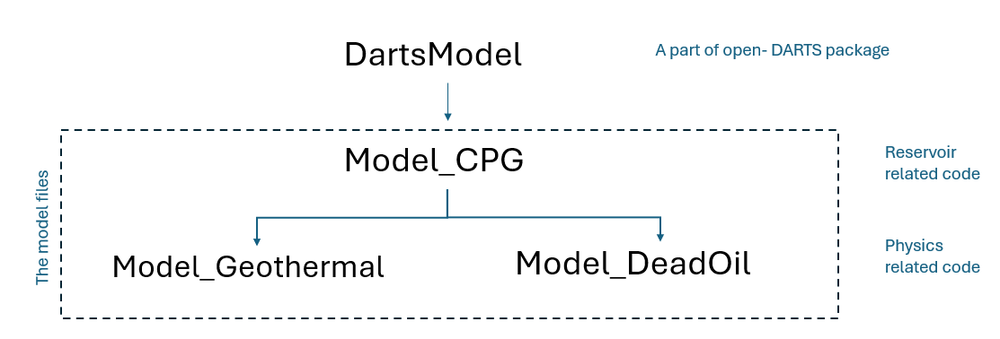
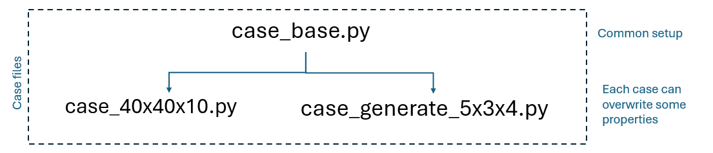
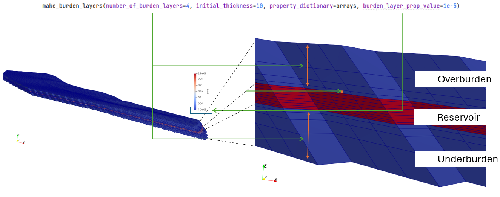
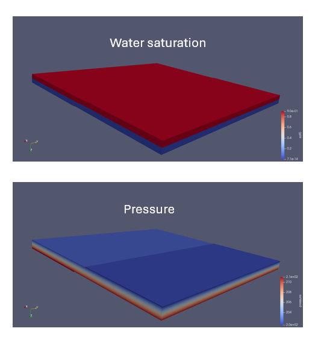
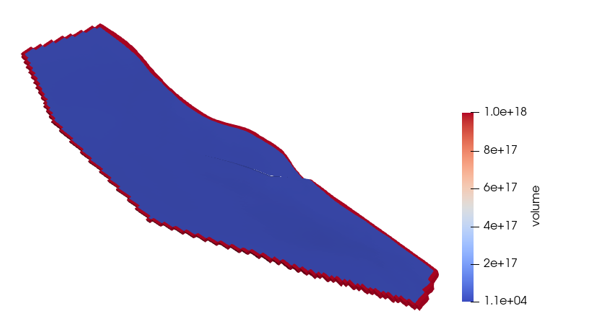
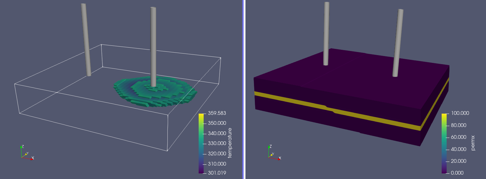
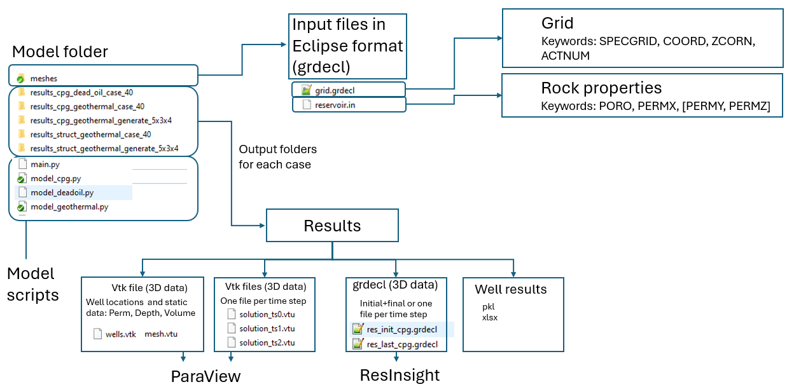

# Description
This example contains CPG (Corner Point Geometry) grid setup. The grid and rock properties can be set using mesh generation (stuctured like grid) and input files (grdecl format).
Model introduces two options for physics: Geothermal and Deadoil (isothermal) with either 2 (one production and one injection) or 1 well (cyclic mode).
Well perforation definition can be done using Python code (XYZ and IJK) and using SCH file (COMPDAT keyword).
Well controls: BHP, volumetric rate with BHP constraint, cyclic production and injection (single well).

# Model class
First, we create a custom Model_CPG (model_cpg.py) class inherited from DARTSModel class. It contains reservoir related code.
Next, we create one more inheritance level for Physics related code (model_geothermal.py or model_deadoil.py).



# Running the simulation 
To run this model, use `darts main.py`.
In `main.py`, we create a model instance and make necessary calls to initialize it.

Choose cases to run:
- geometry, rock properties and well locations
- physics
- well controls
By default, all combinations will be executed for testing purposes.

The `m.run_simulation()` call computes a time step loop.

Finally, optional results processing is done. 
Vtk files output:
```
for ith_step in range(len(m.idata.sim.time_steps)+1):
    m.output_to_vtk(ith_step=ith_step, output_properties=output_properties)
```
Save well rates to excel:
```
time_data_report = pd.DataFrame.from_dict(m.physics.engine.time_data_report)
add_columns_time_data(time_data_report)

writer = pd.ExcelWriter(os.path.join(out_dir, 'time_data.xlsx'))
time_data.to_excel(writer, sheet_name='time_data')
writer.close()
```

# Input case files
In our model classes we add new functions `set_input_data(case)` which takes a string argument `case` and fills in an InputData class object.
For example, if `case` contains the "generate" substring, then gris generation will be used. Otherwise, grid data is supposed to be read from files.
Since there are some properties we would like to keep the same for a few cases, there is `case_base.py` which is called by each case, and some of that properties are overwritten later on by a specific case properties.



# Grid generation
The grid is generated with a function `gen_cpg_grid` and can be with a regular layers thickness, like in case_generate_51x51x1.py:
```
geom.nx = 51
geom.ny = 51
geom.nz = 1
geom.dx = 4000. / geom.nx
geom.dy = geom.dx
geom.dz = 100. / geom.nz
```
and the irregular layers thickness, like in case_generate_5x3x4.py:
```
geom.dx = np.array([500, 200, 100, 300, 500])
geom.dy = np.array([1000, 700, 300])
geom.dz = np.array([100, 150, 180, 120])
```

# Grid initialization from files
This call creates an `arrays` dictionary with keys `SPECGRID`, `COORD`, `ZCORN`, `ACTNUM`, `PORO`, `PERMX`, `PERMY`, `PERMZ`.
```
arrays = m.init_input_arrays()
```
Example case: `case_40x40x10.py`.

Additional arrays can be read as well:
```
    arrays['new_array_name'] = read_float_array(filename, 'new_array_name')
    arrays['new_array_name'] = read_int_array(filename, 'new_array_name')
```

# CPG Reservoir initialization

The main input of the reservoir class is a dictionary of numpy arrays containing grid data and rock properties.

Internal mesh initialization (inactive cells filtering, arrays allocation, cells connectivity and transmissibility computation, etc) happens here:
```
m.init_reservoir(arrays=arrays)
```

# Over- and underburden layers generation

If Over- and underburden layers were not generated in the geological modeling software, or if one uses a mesh generation option in open-DARTS, it is possible to add that layers using the `make_burden_layers` function.
This option enabled by default for geothermal physics case.
The properties `geom.burden_layers, geom.burden_init_thickness, idata.rock.burden_prop` and other are defined in `case_base.py`.



Note: this feature doesn’t work well if the top or the bottom layers are fully or partly inactive (due to ACTNUM=0, PORO=0, thickness=0). 

# Fault transmissibility multipliers
CPG_Reservoir class has an option to pass a filename with fault location and multipliers in format:
```
I1   J1   K1   I2   J2   K2   M
```
where 
`I1,  J1,  K1`  - indices of the first cell, integers
`I2,  J2,  K2`  - indices of the second cell, integers
`M` - multiplier, float value

For example, setting `M=0.0` will make the fault impermeable.

Example case: "generate_51x51x1_faultmult" defined in `case_51x51x1.py`

# Physics initialization
Physics initialization is done in either model_geothermal.py or model_deadoil.py. Each of them have `set_physics` function and its own OBL parameters.

## Geothermal physics
There are two options for Geothermal physics:
```
        # single component, two phase. Pressure and enthalpy are the main variables
        if self.iapws_physics:
            self.physics = Geothermal(self.idata, self.timer)  # IAPWS
        else:
            self.physics = GeothermalPH(self.idata, self.timer)  # Flash
            self.physics.determine_obl_bounds(state_min=[self.idata.obl.min_p, 250.],
                                              state_max=[self.idata.obl.max_p, 575.])
```
There are two options for dynamic fluid properties evaluation: `GeothermalIAPWSFluidProps()` which uses [IAPWS](https://pypi.org/project/iapws/) and `GeothermalPHFluidProps()` which uses Flash.
One can overwrite some evaluators with custom one.

## Deadoil physics
```
self.physics = DeadOil(self.idata, self.timer, thermal=False)
```

## Initial and boundary conditions

# Initial conditions (geothermal physics)
We provide two predefined options: uniform, when just two values are defined, and gradient. However, one can come up with a custom initial distribution.

# Initial conditions (deadoil physics)
Here, the initial pressure is defined by a gradient. The initial saturation is defined by water table depth.



# Boundary conditions
- top and bottom – no flow
- lateral boundaries – large volume, defined in `case_base.py`:
```
geom.bound_volume = 1e18    # lateral boundary volume, m^3
```

In case ACTNUM array is defined, the large volume will be set at the closest to the boundary active cell: 


## Wells
In this model, wells are defined in InputData class.

# Wells and perforations
We use this function to put well and perforations with a particular `I,J` values for each geometric case. 
```
well_data.add_well(name='PRD', loc_type='ijk', loc_ijk=(I, J, -1))
```
The `K` index is set to `-1` since the whole reservoir (except over and underburden layers) is perforated and the `K` index is not actually used in the model's code.

Adding a well perforation using XYZ-coordinates is also possible. For example:
```
well_data.add_well(name='PRD', loc_type='xyz', loc_xyz=(250.0, 500.0, 890.0))
```

# Well controls
There is a custom function `well_is_inj(well_name)` which returns True or False.
For a constant well rate:
```
wdata = self.idata.well_data
wdata.add_inj_bhp_control(name=w, bhp=250, temperature=300)  # m3/day | bars | K
```

## Simulation parameters
In this model, timesteps are defined in InputData class.
```
dt = 365.25  # one report timestep length, [days]
n_time_steps = 20
idata.sim.time_steps = np.zeros(n_time_steps) + dt
```
Timestep and convergence control parameters are defined in `case_base.py`.

Set number of CPU cores or enable GPU: https://open-darts.gitlab.io/open-DARTS/for_developers/configure_hardware.html 


## Output
All output files are created in a subfolder with a case name in a suffix, for example: `results_deadoil_generate_5x3x4_wbhp`.
Note, the output folder is deleted at each run. Please rename it if you would like to save results from the previous run.

# 3D data 
This models outputs 4 types of vtk files, which can be loaded into Paraview:
- solution.pvd and solution_ts[i].vtu - dynamic properties
- mesh.vtk - static properties
- wells.vtk - well location
- centers.vtk - cell center points 

The temperature plum and permeability distribution visualization in Paraview:

It can be loaded using the file `paraview\40x40x10.pvsm` after the case 40x40x10 with geothermal physics and well rate control is computed.

There is also .grdecl file output, which can be loaded into ResInsight. 

Input and output files are illustrated below:


## Screen output and log file
By default, all output (both from Python and C++ parts of open-DARTS) is shown in the console. To redirect the C++ output to a file `redirect_all_output(log_filename)` can be used.

Below you will find some explanation to messages printed:
- DARTS version and compilation date in the first few lines
- Mesh processing information, such a total number of cells and number of active cells:
```
Number of all cells    =  180
Number of active cells =  180
```
- Well perforation processing information (`block` is 1D index in the internal mesh, `WI` is a well index, i.e. connection factor):
```
Added perforation for well PRD to block 60 IJK=[1, 1, 5] XYZ=(250.000000, 500.000000, 1050.000000) with WI=77.258968 WID=90.608130
```
- Linear solver type, engine type, simulation params
- Timesteps and convergence information
- Timers and statistics
